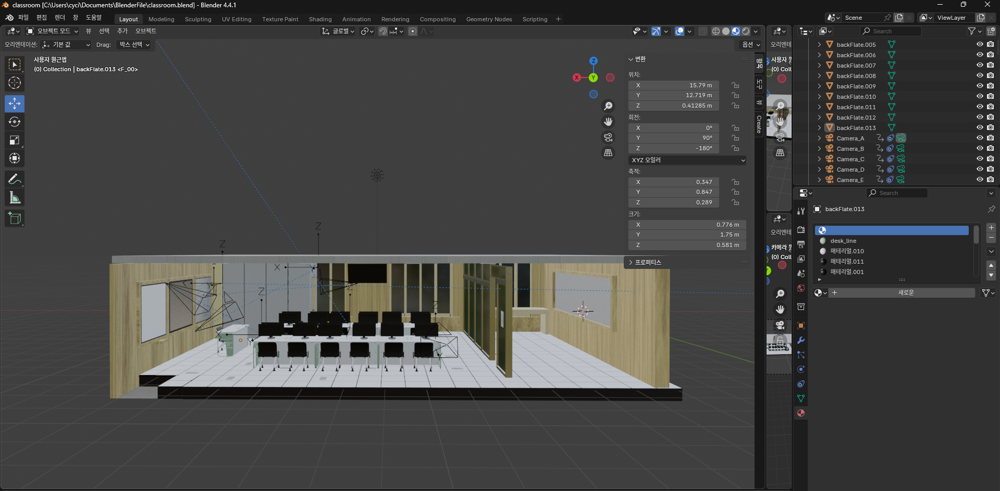

# Blender Classroom 3D Modeling

실제 강의실을 참고하여 Blender로 제작한 3D 강의실 모델링 프로젝트입니다.



---

## 프로젝트 개요

실제 강의실을 직접 촬영한 사진을 레퍼런스로 삼아, Blender에서 강의실 내부를 재현한 3D 모델입니다.
책상, 의자, 바닥, 천장, 벽, 창문, 문 등 강의실 구성 요소를 개별 오브젝트로 제작한 뒤 하나의 씬으로 조립했습니다.

---

## 폴더 구조

```
blenderCNSU/
├── classroom_wtf2.blend   # 메인 강의실 씬 파일
├── be.png                 # 프리뷰 스크린샷
├── fbx_file/              # FBX 익스포트 파일
│   ├── classroom.fbx
│   ├── classroom_wtf.fbx
│   ├── classroom_wtf2.fbx
│   ├── classroom_wtf3.fbx
│   └── desk_col.fbx
├── img/                   # 레퍼런스 사진 및 텍스처 이미지
│   ├── IMG_20250605_134249.jpg
│   ├── IMG_20250607_122047.jpg
│   ├── IMG_20250607_144354.jpg
│   ├── ceil2.jpg
│   ├── ceiling_pattern.jpg
│   ├── floor_elec.jpg
│   ├── glass_warninig.jpg
│   └── whiteboard_grapity.jpg
└── part/                  # 개별 파트 블렌드 파일
    ├── camera_practice.blend
    ├── ceiling.blend
    ├── ceiling_air_conditional.blend
    ├── chair.blend
    ├── chair_prefab.blend
    ├── classRoom_prefab.blend
    ├── classroom.blend
    ├── desk.blend
    ├── desk_col.blend
    ├── desk_prefab.blend
    ├── door_handle.blend
    ├── floor.blend
    ├── glassWall.blend
    ├── light.blend
    ├── renderVideo.blend
    ├── strawberry.blend
    ├── window.blend
    └── wood_wall.blend
```

---

## 주요 구성 요소

| 파트 | 설명 |
|------|------|
| `desk` / `desk_col` | 강의실 책상 (일반 / 충돌 메시 포함) |
| `chair` | 강의실 의자 |
| `floor` | 강의실 바닥 |
| `ceiling` | 천장 (에어컨 포함) |
| `wood_wall` | 목재 벽 |
| `glassWall` | 유리 벽 |
| `window` | 창문 |
| `door_handle` | 문 손잡이 |
| `light` | 조명 |

---

## 사용 도구

- **Blender** 4.x
- FBX 포맷으로 익스포트하여 외부 엔진 활용 가능

---

## 레퍼런스

`img/` 폴더에 포함된 실제 강의실 촬영 사진을 모델링의 기준으로 사용했습니다.
